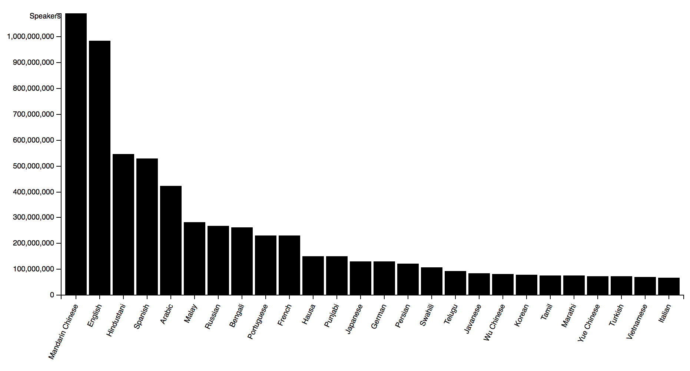

# Assessment 1
For Assessment 1, we had to make a simple chart of given data. The barchart is used to visualize the amount of languages that is spoken.

## Features
* [d3.tsv](https://github.com/d3/d3-request/blob/master/README.md#tsv)
* [d3.select](https://github.com/d3/d3-selection/blob/master/README.md#select)
* [d3.scaleBand()](https://github.com/d3/d3-scale/blob/master/README.md#scaleBand)
* [d3.scaleLinear()](https://github.com/d3/d3-scale/blob/master/README.md#scaleLinear)
* [d3.max](https://github.com/d3/d3-array/blob/master/README.md#max)
* [d3.axisBottom()](https://github.com/d3/d3-array/blob/master/README.md#max)
* [d3.axisLeft()](https://github.com/d3/d3-axis/blob/master/README.md#axisLeft)

### License
Released under the GNU General Public License, version 3.
Used code of user @JeffreyKuik